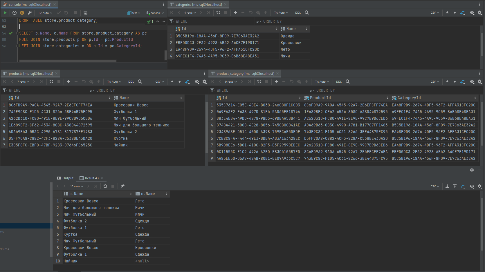

# MS-SQL-Server
## Задание:
В базе данных MS SQL Server есть продукты и категории. Одному продукту может соответствовать много категорий, в одной категории может быть много продуктов. Напишите SQL запрос для выбора всех пар «Имя продукта – Имя категории». Если у продукта нет категорий, то его имя все равно должно выводиться.

## Результат:
### Запрос в БД:
```sql
SELECT p.Name, c.Name FROM store.product_category AS pc
FULL JOIN store.products p ON p.Id = pc.ProductId
LEFT JOIN store.categories c ON c.Id = pc.CategoryId;
```
### Результат:

